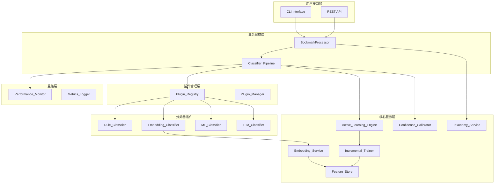
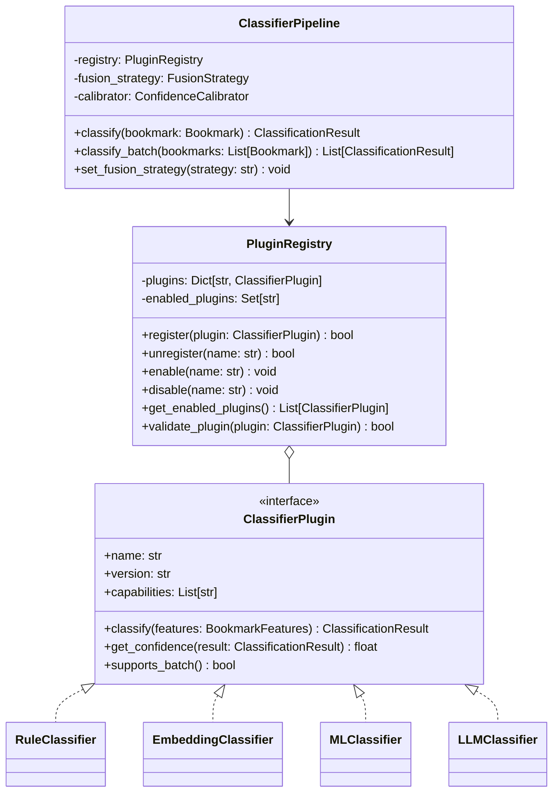

# Design Document: Architecture Algorithm Upgrade

## Overview

本设计文档描述了 CleanBook 智能书签分类系统的架构升级方案，将现有单体架构演进为模块化、可扩展的插件式架构，并引入先进的分类算法（Transformer 嵌入、主动学习、增量学习）以提升分类准确率和系统性能。

### 设计目标

1. **可扩展性**: 通过插件架构支持分类器、导出器、特征提取器的热插拔
2. **准确性**: 引入 Transformer 嵌入和多方法融合优化提升分类精度
3. **适应性**: 通过主动学习和增量学习实现模型持续改进
4. **性能**: 通过特征缓存和智能调度优化处理速度
5. **可观测性**: 完善的监控指标和性能追踪

### 当前架构分析

现有系统采用分层架构：
- `EnhancedClassifier`: 主分类器，集成规则引擎、ML分类器、LLM分类器
- `RuleEngine`: 基于规则的快速分类
- `MLBookmarkClassifier`: 基于 sklearn 的机器学习分类
- `TaxonomyStandardizer`: 分类体系标准化

主要局限：
- 分类器硬编码，难以扩展
- 缺乏统一的插件管理机制
- 特征提取与分类耦合
- 缺少主动学习和增量更新能力

## Architecture

### 整体架构图



### 插件架构设计



## Components and Interfaces

### 1. Plugin_Registry (插件注册中心)

```python
from abc import ABC, abstractmethod
from typing import Dict, List, Optional, Set, Any
from dataclasses import dataclass, field
from datetime import datetime
import threading

@dataclass
class PluginMetadata:
    """插件元数据"""
    name: str
    version: str
    capabilities: List[str]
    author: str = ""
    description: str = ""
    dependencies: List[str] = field(default_factory=list)
    priority: int = 100  # 数值越小优先级越高

class ClassifierPlugin(ABC):
    """分类器插件接口"""
    
    @property
    @abstractmethod
    def metadata(self) -> PluginMetadata:
        """返回插件元数据"""
        pass
    
    @abstractmethod
    def classify(self, features: 'BookmarkFeatures') -> Optional['ClassificationResult']:
        """执行分类"""
        pass
    
    @abstractmethod
    def initialize(self, config: Dict[str, Any]) -> bool:
        """初始化插件"""
        pass
    
    @abstractmethod
    def shutdown(self) -> None:
        """关闭插件"""
        pass
    
    def supports_batch(self) -> bool:
        """是否支持批量处理"""
        return False
    
    def classify_batch(self, features_list: List['BookmarkFeatures']) -> List[Optional['ClassificationResult']]:
        """批量分类（默认实现）"""
        return [self.classify(f) for f in features_list]

class PluginRegistry:
    """插件注册中心"""
    
    def __init__(self):
        self._plugins: Dict[str, ClassifierPlugin] = {}
        self._enabled: Set[str] = set()
        self._lock = threading.RLock()
        self._listeners: List[callable] = []
    
    def register(self, plugin: ClassifierPlugin) -> bool:
        """注册插件"""
        with self._lock:
            if not self._validate_plugin(plugin):
                return False
            name = plugin.metadata.name
            self._plugins[name] = plugin
            self._notify_listeners('registered', name)
            return True
    
    def unregister(self, name: str) -> bool:
        """注销插件"""
        with self._lock:
            if name in self._plugins:
                self._plugins[name].shutdown()
                del self._plugins[name]
                self._enabled.discard(name)
                self._notify_listeners('unregistered', name)
                return True
            return False
    
    def enable(self, name: str) -> bool:
        """启用插件"""
        with self._lock:
            if name in self._plugins:
                self._enabled.add(name)
                self._notify_listeners('enabled', name)
                return True
            return False
    
    def disable(self, name: str) -> bool:
        """禁用插件"""
        with self._lock:
            if name in self._enabled:
                self._enabled.discard(name)
                self._notify_listeners('disabled', name)
                return True
            return False
    
    def get_enabled_plugins(self) -> List[ClassifierPlugin]:
        """获取已启用的插件（按优先级排序）"""
        with self._lock:
            plugins = [self._plugins[name] for name in self._enabled if name in self._plugins]
            return sorted(plugins, key=lambda p: p.metadata.priority)
    
    def _validate_plugin(self, plugin: ClassifierPlugin) -> bool:
        """验证插件实现"""
        required_methods = ['classify', 'initialize', 'shutdown']
        for method in required_methods:
            if not callable(getattr(plugin, method, None)):
                return False
        if not isinstance(plugin.metadata, PluginMetadata):
            return False
        return True
    
    def _notify_listeners(self, event: str, plugin_name: str):
        """通知监听器"""
        for listener in self._listeners:
            try:
                listener(event, plugin_name)
            except Exception:
                pass
```

### 2. Embedding_Service (嵌入服务)

```python
from typing import Optional, Dict, List
import numpy as np

class EmbeddingService:
    """Transformer 嵌入服务"""
    
    def __init__(self, config: Dict[str, Any]):
        self.config = config
        self.model = None
        self.model_name = config.get('model_name', 'paraphrase-multilingual-MiniLM-L12-v2')
        self.feature_store: Optional['FeatureStore'] = None
        self._fallback_vectorizer = None  # TF-IDF 降级
    
    def initialize(self) -> bool:
        """初始化嵌入模型"""
        try:
            from sentence_transformers import SentenceTransformer
            self.model = SentenceTransformer(self.model_name)
            return True
        except Exception as e:
            # 降级到 TF-IDF
            self._init_fallback()
            return False
    
    def _init_fallback(self):
        """初始化 TF-IDF 降级方案"""
        from sklearn.feature_extraction.text import TfidfVectorizer
        self._fallback_vectorizer = TfidfVectorizer(max_features=512)
    
    def embed(self, text: str) -> np.ndarray:
        """生成文本嵌入"""
        # 检查缓存
        if self.feature_store:
            cached = self.feature_store.get(text)
            if cached is not None:
                return cached
        
        # 生成嵌入
        if self.model:
            embedding = self.model.encode(text, convert_to_numpy=True)
        elif self._fallback_vectorizer:
            embedding = self._fallback_vectorizer.transform([text]).toarray()[0]
        else:
            raise RuntimeError("No embedding model available")
        
        # 缓存结果
        if self.feature_store:
            self.feature_store.put(text, embedding)
        
        return embedding
    
    def embed_batch(self, texts: List[str]) -> np.ndarray:
        """批量生成嵌入"""
        if self.model:
            return self.model.encode(texts, convert_to_numpy=True)
        elif self._fallback_vectorizer:
            return self._fallback_vectorizer.transform(texts).toarray()
        raise RuntimeError("No embedding model available")
    
    def compute_similarity(self, embedding1: np.ndarray, embedding2: np.ndarray) -> float:
        """计算余弦相似度"""
        norm1 = np.linalg.norm(embedding1)
        norm2 = np.linalg.norm(embedding2)
        if norm1 == 0 or norm2 == 0:
            return 0.0
        return float(np.dot(embedding1, embedding2) / (norm1 * norm2))
```

### 3. Active_Learning_Engine (主动学习引擎)

```python
from dataclasses import dataclass
from typing import List, Optional, Tuple
from collections import deque
import heapq

@dataclass
class ReviewItem:
    """待审核项"""
    bookmark_id: str
    url: str
    title: str
    predicted_category: str
    confidence: float
    alternatives: List[Tuple[str, float]]
    uncertainty_score: float
    timestamp: datetime

class ActiveLearningEngine:
    """主动学习引擎"""
    
    def __init__(self, config: Dict[str, Any]):
        self.config = config
        self.confidence_threshold = config.get('confidence_threshold', 0.6)
        self.max_requests_per_session = config.get('max_requests_per_session', 10)
        self.review_queue: List[ReviewItem] = []  # 优先队列
        self.labeled_samples: List[Dict] = []
        self.session_request_count = 0
    
    def process_classification(self, bookmark: Dict, result: 'ClassificationResult') -> Optional[ReviewItem]:
        """处理分类结果，识别低置信度样本"""
        if result.confidence >= self.confidence_threshold:
            return None
        
        # 计算不确定性分数（熵）
        uncertainty = self._calculate_uncertainty(result)
        
        item = ReviewItem(
            bookmark_id=bookmark.get('id', ''),
            url=bookmark.get('url', ''),
            title=bookmark.get('title', ''),
            predicted_category=result.category,
            confidence=result.confidence,
            alternatives=result.alternative_categories[:3],
            uncertainty_score=uncertainty,
            timestamp=datetime.now()
        )
        
        # 按不确定性分数加入优先队列
        heapq.heappush(self.review_queue, (-uncertainty, item))
        return item
    
    def _calculate_uncertainty(self, result: 'ClassificationResult') -> float:
        """计算不确定性分数（基于熵）"""
        scores = [result.confidence] + [s for _, s in result.alternative_categories]
        total = sum(scores)
        if total == 0:
            return 1.0
        probs = [s / total for s in scores]
        entropy = -sum(p * np.log(p + 1e-10) for p in probs if p > 0)
        return entropy
    
    def get_next_review_item(self) -> Optional[ReviewItem]:
        """获取下一个待审核项"""
        if self.session_request_count >= self.max_requests_per_session:
            return None
        if not self.review_queue:
            return None
        
        self.session_request_count += 1
        _, item = heapq.heappop(self.review_queue)
        return item
    
    def submit_feedback(self, bookmark_id: str, correct_category: str):
        """提交用户反馈"""
        sample = {
            'bookmark_id': bookmark_id,
            'correct_category': correct_category,
            'timestamp': datetime.now().isoformat()
        }
        self.labeled_samples.append(sample)
    
    def get_labeled_samples(self) -> List[Dict]:
        """获取已标注样本用于训练"""
        return self.labeled_samples.copy()
    
    def reset_session(self):
        """重置会话计数"""
        self.session_request_count = 0
```

### 4. Incremental_Trainer (增量训练器)

```python
import os
import shutil
from typing import Optional, List, Dict
from datetime import datetime

class IncrementalTrainer:
    """增量训练器"""
    
    def __init__(self, config: Dict[str, Any]):
        self.config = config
        self.batch_size = config.get('batch_size', 100)
        self.model_dir = config.get('model_dir', 'models/incremental')
        self.max_versions = config.get('max_versions', 5)
        self.performance_threshold = config.get('performance_threshold', 0.8)
        
        self.pending_samples: List[Dict] = []
        self.model_versions: List[str] = []
        self.current_version: Optional[str] = None
        self.model = None
    
    def add_sample(self, features: Dict, label: str):
        """添加训练样本"""
        self.pending_samples.append({'features': features, 'label': label})
        
        if len(self.pending_samples) >= self.batch_size:
            self._trigger_incremental_update()
    
    def _trigger_incremental_update(self):
        """触发增量更新"""
        if not self.pending_samples:
            return
        
        # 保存当前版本
        self._save_version()
        
        # 执行增量训练
        try:
            self._partial_fit(self.pending_samples)
            self.pending_samples.clear()
            
            # 验证性能
            if not self._validate_performance():
                self.rollback()
        except Exception as e:
            self.rollback()
            raise
    
    def _partial_fit(self, samples: List[Dict]):
        """执行 partial_fit"""
        if self.model is None:
            return
        
        X = [s['features'] for s in samples]
        y = [s['label'] for s in samples]
        
        if hasattr(self.model, 'partial_fit'):
            self.model.partial_fit(X, y)
    
    def _save_version(self):
        """保存模型版本"""
        version_id = datetime.now().strftime('%Y%m%d_%H%M%S')
        version_path = os.path.join(self.model_dir, f'version_{version_id}')
        
        os.makedirs(version_path, exist_ok=True)
        # 原子性保存
        temp_path = version_path + '.tmp'
        try:
            self._serialize_model(temp_path)
            shutil.move(temp_path, version_path)
            self.model_versions.append(version_id)
            self.current_version = version_id
            
            # 清理旧版本
            self._cleanup_old_versions()
        except Exception:
            if os.path.exists(temp_path):
                shutil.rmtree(temp_path)
            raise
    
    def _serialize_model(self, path: str):
        """序列化模型"""
        import joblib
        os.makedirs(path, exist_ok=True)
        joblib.dump(self.model, os.path.join(path, 'model.pkl'))
    
    def _cleanup_old_versions(self):
        """清理旧版本"""
        while len(self.model_versions) > self.max_versions:
            old_version = self.model_versions.pop(0)
            old_path = os.path.join(self.model_dir, f'version_{old_version}')
            if os.path.exists(old_path):
                shutil.rmtree(old_path)
    
    def _validate_performance(self) -> bool:
        """验证模型性能"""
        # 使用验证集评估
        # 返回 True 如果性能达标
        return True  # 简化实现
    
    def rollback(self) -> bool:
        """回滚到上一版本"""
        if len(self.model_versions) < 2:
            return False
        
        # 移除当前版本
        current = self.model_versions.pop()
        current_path = os.path.join(self.model_dir, f'version_{current}')
        if os.path.exists(current_path):
            shutil.rmtree(current_path)
        
        # 加载上一版本
        previous = self.model_versions[-1]
        self._load_version(previous)
        self.current_version = previous
        return True
    
    def _load_version(self, version_id: str):
        """加载指定版本"""
        import joblib
        version_path = os.path.join(self.model_dir, f'version_{version_id}', 'model.pkl')
        if os.path.exists(version_path):
            self.model = joblib.load(version_path)
```

### 5. Classifier_Pipeline (分类器管道)

```python
from enum import Enum
from typing import Dict, List, Optional, Callable

class FusionStrategy(Enum):
    WEIGHTED_VOTING = "weighted_voting"
    STACKING = "stacking"
    BAYESIAN = "bayesian"

class ClassifierPipeline:
    """分类器管道"""
    
    def __init__(self, registry: PluginRegistry, config: Dict[str, Any]):
        self.registry = registry
        self.config = config
        self.fusion_strategy = FusionStrategy(config.get('fusion_strategy', 'weighted_voting'))
        self.calibrator = ConfidenceCalibrator()
        self.method_weights: Dict[str, float] = {}
        self.method_stats: Dict[str, Dict] = {}
        self.conflict_rules: Dict[str, str] = config.get('conflict_rules', {})
    
    def classify(self, features: 'BookmarkFeatures') -> 'ClassificationResult':
        """执行分类"""
        results: List[Tuple[str, ClassificationResult]] = []
        
        # 按优先级调用所有启用的插件
        for plugin in self.registry.get_enabled_plugins():
            try:
                result = plugin.classify(features)
                if result:
                    results.append((plugin.metadata.name, result))
            except Exception as e:
                # 记录错误，继续处理
                self._log_plugin_error(plugin.metadata.name, e)
                continue
        
        if not results:
            return self._default_result()
        
        # 融合结果
        fused = self._fuse_results(results)
        
        # 校准置信度
        fused.confidence = self.calibrator.calibrate(fused.confidence)
        
        return fused
    
    def _fuse_results(self, results: List[Tuple[str, 'ClassificationResult']]) -> 'ClassificationResult':
        """融合多个分类结果"""
        if self.fusion_strategy == FusionStrategy.WEIGHTED_VOTING:
            return self._weighted_voting(results)
        elif self.fusion_strategy == FusionStrategy.STACKING:
            return self._stacking(results)
        elif self.fusion_strategy == FusionStrategy.BAYESIAN:
            return self._bayesian_combination(results)
        return results[0][1]
    
    def _weighted_voting(self, results: List[Tuple[str, 'ClassificationResult']]) -> 'ClassificationResult':
        """加权投票融合"""
        category_scores: Dict[str, float] = {}
        
        for method_name, result in results:
            weight = self.method_weights.get(method_name, 1.0)
            score = result.confidence * weight
            
            if result.category in category_scores:
                category_scores[result.category] += score
            else:
                category_scores[result.category] = score
        
        # 检查冲突
        if len(set(r[1].category for r in results)) > 1:
            category_scores = self._resolve_conflicts(category_scores, results)
        
        # 选择最高分
        best_category = max(category_scores, key=category_scores.get)
        total_score = sum(category_scores.values())
        confidence = category_scores[best_category] / total_score if total_score > 0 else 0
        
        return ClassificationResult(
            category=best_category,
            confidence=confidence,
            score_breakdown=category_scores,
            alternative_categories=[(c, s/total_score) for c, s in category_scores.items() if c != best_category],
            reasoning=[f"Weighted voting from {len(results)} methods"],
            method='pipeline_fusion'
        )
    
    def _resolve_conflicts(self, scores: Dict[str, float], results: List) -> Dict[str, float]:
        """应用冲突解决规则"""
        for rule_key, rule_action in self.conflict_rules.items():
            if rule_action == 'prefer_rule_engine':
                for method_name, result in results:
                    if 'rule' in method_name.lower():
                        scores[result.category] *= 1.5
        return scores
    
    def update_method_weight(self, method_name: str, accuracy: float):
        """根据准确率更新方法权重"""
        current_weight = self.method_weights.get(method_name, 1.0)
        # 指数移动平均
        alpha = 0.1
        new_weight = alpha * accuracy + (1 - alpha) * current_weight
        self.method_weights[method_name] = new_weight
    
    def _log_plugin_error(self, plugin_name: str, error: Exception):
        """记录插件错误"""
        if plugin_name not in self.method_stats:
            self.method_stats[plugin_name] = {'errors': 0, 'calls': 0}
        self.method_stats[plugin_name]['errors'] += 1
```


### 6. Feature_Store (特征存储)

```python
import os
import pickle
import time
from typing import Optional, Dict, Any
from collections import OrderedDict
import numpy as np
import threading

class FeatureStore:
    """特征存储与缓存"""
    
    def __init__(self, config: Dict[str, Any]):
        self.config = config
        self.max_size = config.get('max_size', 100000)
        self.ttl_seconds = config.get('ttl_seconds', 86400 * 7)  # 7天
        self.persist_path = config.get('persist_path', 'cache/features')
        self.hit_rate_threshold = config.get('hit_rate_threshold', 0.5)
        
        self._cache: OrderedDict = OrderedDict()
        self._timestamps: Dict[str, float] = {}
        self._lock = threading.RLock()
        
        # 统计
        self._hits = 0
        self._misses = 0
        
        # ANN 索引（可选）
        self._ann_index = None
    
    def get(self, key: str) -> Optional[np.ndarray]:
        """获取缓存的特征"""
        with self._lock:
            if key not in self._cache:
                self._misses += 1
                self._check_hit_rate()
                return None
            
            # 检查 TTL
            if time.time() - self._timestamps[key] > self.ttl_seconds:
                self._evict(key)
                self._misses += 1
                return None
            
            # LRU: 移到末尾
            self._cache.move_to_end(key)
            self._hits += 1
            return self._cache[key]
    
    def put(self, key: str, value: np.ndarray):
        """存储特征"""
        with self._lock:
            # LRU 驱逐
            while len(self._cache) >= self.max_size:
                oldest_key = next(iter(self._cache))
                self._evict(oldest_key)
            
            self._cache[key] = value
            self._timestamps[key] = time.time()
    
    def _evict(self, key: str):
        """驱逐缓存项"""
        if key in self._cache:
            del self._cache[key]
        if key in self._timestamps:
            del self._timestamps[key]
    
    def _check_hit_rate(self):
        """检查命中率"""
        total = self._hits + self._misses
        if total > 1000:
            hit_rate = self._hits / total
            if hit_rate < self.hit_rate_threshold:
                import logging
                logging.warning(f"Feature cache hit rate ({hit_rate:.2%}) below threshold. Consider increasing cache size.")
    
    def find_similar(self, embedding: np.ndarray, top_k: int = 5) -> List[Tuple[str, float]]:
        """近似最近邻搜索"""
        if self._ann_index is None:
            return self._brute_force_search(embedding, top_k)
        # 使用 ANN 索引
        return self._ann_search(embedding, top_k)
    
    def _brute_force_search(self, embedding: np.ndarray, top_k: int) -> List[Tuple[str, float]]:
        """暴力搜索（小规模数据）"""
        similarities = []
        with self._lock:
            for key, cached_embedding in self._cache.items():
                sim = self._cosine_similarity(embedding, cached_embedding)
                similarities.append((key, sim))
        
        similarities.sort(key=lambda x: x[1], reverse=True)
        return similarities[:top_k]
    
    def _cosine_similarity(self, a: np.ndarray, b: np.ndarray) -> float:
        """计算余弦相似度"""
        norm_a = np.linalg.norm(a)
        norm_b = np.linalg.norm(b)
        if norm_a == 0 or norm_b == 0:
            return 0.0
        return float(np.dot(a, b) / (norm_a * norm_b))
    
    def persist(self):
        """持久化到磁盘"""
        os.makedirs(self.persist_path, exist_ok=True)
        with self._lock:
            data = {
                'cache': dict(self._cache),
                'timestamps': self._timestamps,
                'stats': {'hits': self._hits, 'misses': self._misses}
            }
            with open(os.path.join(self.persist_path, 'features.pkl'), 'wb') as f:
                pickle.dump(data, f)
    
    def load(self):
        """从磁盘加载"""
        path = os.path.join(self.persist_path, 'features.pkl')
        if not os.path.exists(path):
            return
        
        with open(path, 'rb') as f:
            data = pickle.load(f)
        
        with self._lock:
            self._cache = OrderedDict(data.get('cache', {}))
            self._timestamps = data.get('timestamps', {})
            stats = data.get('stats', {})
            self._hits = stats.get('hits', 0)
            self._misses = stats.get('misses', 0)
    
    def warm_cache(self, historical_data: List[Dict]):
        """缓存预热"""
        for item in historical_data:
            if 'key' in item and 'embedding' in item:
                self.put(item['key'], item['embedding'])
    
    def get_stats(self) -> Dict:
        """获取统计信息"""
        total = self._hits + self._misses
        return {
            'size': len(self._cache),
            'max_size': self.max_size,
            'hits': self._hits,
            'misses': self._misses,
            'hit_rate': self._hits / total if total > 0 else 0
        }
```

### 7. Taxonomy_Service (分类体系服务)

```python
import os
import re
import yaml
from typing import Dict, List, Optional, Tuple
from datetime import datetime

class TaxonomyService:
    """分类体系动态管理服务"""
    
    VALID_NAME_PATTERN = re.compile(r'^[\w\u4e00-\u9fff][\w\u4e00-\u9fff\s\-]{0,49}$')
    
    def __init__(self, config: Dict[str, Any]):
        self.config = config
        self.taxonomy_path = config.get('taxonomy_path', 'taxonomy/subjects.yaml')
        self.migrations_path = config.get('migrations_path', 'taxonomy/migrations')
        
        self._hierarchy: Dict = {}
        self._change_log: List[Dict] = []
        self._load_taxonomy()
    
    def _load_taxonomy(self):
        """加载分类体系"""
        if not os.path.exists(self.taxonomy_path):
            self._hierarchy = {'subjects': []}
            return
        
        with open(self.taxonomy_path, 'r', encoding='utf-8') as f:
            self._hierarchy = yaml.safe_load(f) or {'subjects': []}
    
    def add_category(self, name: str, parent: Optional[str] = None, variants: List[str] = None) -> bool:
        """添加新分类"""
        if not self._validate_name(name):
            return False
        
        new_entry = {
            'preferred': name,
            'variants': variants or []
        }
        
        if parent:
            # 添加到父分类下
            for subject in self._hierarchy.get('subjects', []):
                if subject.get('preferred') == parent:
                    if 'children' not in subject:
                        subject['children'] = []
                    subject['children'].append(new_entry)
                    break
        else:
            self._hierarchy.setdefault('subjects', []).append(new_entry)
        
        self._record_change('add', name, None)
        self._save_taxonomy()
        return True
    
    def rename_category(self, old_name: str, new_name: str) -> bool:
        """重命名分类"""
        if not self._validate_name(new_name):
            return False
        
        for subject in self._hierarchy.get('subjects', []):
            if subject.get('preferred') == old_name:
                subject['preferred'] = new_name
                # 将旧名称添加为变体
                if 'variants' not in subject:
                    subject['variants'] = []
                if old_name not in subject['variants']:
                    subject['variants'].append(old_name)
                
                self._record_change('rename', old_name, new_name)
                self._save_taxonomy()
                return True
        
        return False
    
    def merge_categories(self, source: str, target: str) -> bool:
        """合并分类"""
        source_entry = None
        source_idx = None
        target_entry = None
        
        subjects = self._hierarchy.get('subjects', [])
        for i, subject in enumerate(subjects):
            if subject.get('preferred') == source:
                source_entry = subject
                source_idx = i
            if subject.get('preferred') == target:
                target_entry = subject
        
        if not source_entry or not target_entry:
            return False
        
        # 合并变体
        target_variants = set(target_entry.get('variants', []))
        target_variants.add(source)
        target_variants.update(source_entry.get('variants', []))
        target_entry['variants'] = list(target_variants)
        
        # 删除源分类
        subjects.pop(source_idx)
        
        self._record_change('merge', source, target)
        self._save_taxonomy()
        return True
    
    def _validate_name(self, name: str) -> bool:
        """验证分类名称"""
        if not name or len(name) > 50:
            return False
        return bool(self.VALID_NAME_PATTERN.match(name))
    
    def _record_change(self, action: str, source: str, target: Optional[str]):
        """记录变更"""
        change = {
            'action': action,
            'source': source,
            'target': target,
            'timestamp': datetime.now().isoformat()
        }
        self._change_log.append(change)
    
    def _save_taxonomy(self):
        """保存分类体系"""
        os.makedirs(os.path.dirname(self.taxonomy_path), exist_ok=True)
        with open(self.taxonomy_path, 'w', encoding='utf-8') as f:
            yaml.dump(self._hierarchy, f, allow_unicode=True, default_flow_style=False)
    
    def export_migrations(self) -> str:
        """导出迁移脚本"""
        os.makedirs(self.migrations_path, exist_ok=True)
        
        migration_content = "# Taxonomy Migration Script\n"
        migration_content += f"# Generated: {datetime.now().isoformat()}\n\n"
        
        for change in self._change_log:
            if change['action'] == 'add':
                migration_content += f"ADD_CATEGORY: {change['source']}\n"
            elif change['action'] == 'rename':
                migration_content += f"RENAME: {change['source']} -> {change['target']}\n"
            elif change['action'] == 'merge':
                migration_content += f"MERGE: {change['source']} -> {change['target']}\n"
        
        filename = f"migration_{datetime.now().strftime('%Y%m%d_%H%M%S')}.txt"
        filepath = os.path.join(self.migrations_path, filename)
        
        with open(filepath, 'w', encoding='utf-8') as f:
            f.write(migration_content)
        
        return filepath
    
    def get_all_categories(self) -> List[str]:
        """获取所有分类"""
        categories = []
        for subject in self._hierarchy.get('subjects', []):
            categories.append(subject.get('preferred', ''))
        return categories
```

### 8. Performance_Monitor (性能监控)

```python
import time
import statistics
from typing import Dict, List, Optional
from collections import defaultdict, deque
from datetime import datetime, timedelta
import threading

class PerformanceMonitor:
    """性能监控服务"""
    
    def __init__(self, config: Dict[str, Any]):
        self.config = config
        self.latency_threshold = config.get('latency_threshold_ms', 100)
        self.window_size = config.get('window_size', 10000)
        
        self._latencies: deque = deque(maxlen=self.window_size)
        self._method_stats: Dict[str, Dict] = defaultdict(lambda: {
            'calls': 0, 'correct': 0, 'confidences': deque(maxlen=1000)
        })
        self._cache_stats = {'hits': 0, 'misses': 0}
        self._memory_samples: deque = deque(maxlen=100)
        self._alerts: List[Dict] = []
        self._lock = threading.RLock()
    
    def record_classification(self, method: str, latency_ms: float, 
                             confidence: float, correct: Optional[bool] = None):
        """记录分类指标"""
        with self._lock:
            self._latencies.append(latency_ms)
            
            stats = self._method_stats[method]
            stats['calls'] += 1
            stats['confidences'].append(confidence)
            if correct is not None:
                if correct:
                    stats['correct'] += 1
            
            # 检查延迟阈值
            if latency_ms > self.latency_threshold:
                self._emit_alert('latency', f"Classification latency {latency_ms:.2f}ms exceeds threshold")
    
    def record_cache_access(self, hit: bool):
        """记录缓存访问"""
        with self._lock:
            if hit:
                self._cache_stats['hits'] += 1
            else:
                self._cache_stats['misses'] += 1
    
    def record_memory_usage(self, bytes_used: int):
        """记录内存使用"""
        with self._lock:
            self._memory_samples.append({
                'timestamp': datetime.now(),
                'bytes': bytes_used
            })
    
    def get_latency_percentiles(self) -> Dict[str, float]:
        """获取延迟百分位数"""
        with self._lock:
            if not self._latencies:
                return {'p50': 0, 'p95': 0, 'p99': 0}
            
            sorted_latencies = sorted(self._latencies)
            n = len(sorted_latencies)
            
            return {
                'p50': sorted_latencies[int(n * 0.5)],
                'p95': sorted_latencies[int(n * 0.95)] if n > 20 else sorted_latencies[-1],
                'p99': sorted_latencies[int(n * 0.99)] if n > 100 else sorted_latencies[-1]
            }
    
    def get_method_accuracy(self, method: str) -> float:
        """获取方法准确率"""
        with self._lock:
            stats = self._method_stats.get(method, {})
            calls = stats.get('calls', 0)
            correct = stats.get('correct', 0)
            return correct / calls if calls > 0 else 0
    
    def get_confidence_distribution(self, method: str) -> Dict[str, int]:
        """获取置信度分布"""
        with self._lock:
            stats = self._method_stats.get(method, {})
            confidences = stats.get('confidences', [])
            
            distribution = defaultdict(int)
            for conf in confidences:
                bucket = int(conf * 10) / 10  # 0.0, 0.1, ..., 0.9
                distribution[f"{bucket:.1f}"] += 1
            
            return dict(distribution)
    
    def get_cache_hit_rate(self) -> float:
        """获取缓存命中率"""
        with self._lock:
            total = self._cache_stats['hits'] + self._cache_stats['misses']
            return self._cache_stats['hits'] / total if total > 0 else 0
    
    def _emit_alert(self, alert_type: str, message: str):
        """发出告警"""
        alert = {
            'type': alert_type,
            'message': message,
            'timestamp': datetime.now().isoformat()
        }
        self._alerts.append(alert)
        # 可以集成外部告警系统
    
    def export_prometheus_metrics(self) -> str:
        """导出 Prometheus 格式指标"""
        lines = []
        
        # 延迟指标
        percentiles = self.get_latency_percentiles()
        lines.append(f'classification_latency_p50 {percentiles["p50"]}')
        lines.append(f'classification_latency_p95 {percentiles["p95"]}')
        lines.append(f'classification_latency_p99 {percentiles["p99"]}')
        
        # 方法准确率
        for method, stats in self._method_stats.items():
            accuracy = self.get_method_accuracy(method)
            lines.append(f'classification_accuracy{{method="{method}"}} {accuracy}')
            lines.append(f'classification_calls{{method="{method}"}} {stats["calls"]}')
        
        # 缓存指标
        lines.append(f'cache_hit_rate {self.get_cache_hit_rate()}')
        lines.append(f'cache_hits_total {self._cache_stats["hits"]}')
        lines.append(f'cache_misses_total {self._cache_stats["misses"]}')
        
        return '\n'.join(lines)
    
    def generate_daily_report(self) -> Dict:
        """生成每日报告"""
        return {
            'date': datetime.now().strftime('%Y-%m-%d'),
            'latency_percentiles': self.get_latency_percentiles(),
            'method_stats': {
                method: {
                    'calls': stats['calls'],
                    'accuracy': self.get_method_accuracy(method),
                    'confidence_distribution': self.get_confidence_distribution(method)
                }
                for method, stats in self._method_stats.items()
            },
            'cache_hit_rate': self.get_cache_hit_rate(),
            'alerts_count': len(self._alerts)
        }
```


## Data Models

### 核心数据结构

```python
from dataclasses import dataclass, field
from typing import Dict, List, Optional, Tuple, Any
from datetime import datetime
from enum import Enum

@dataclass
class BookmarkFeatures:
    """书签特征"""
    url: str
    title: str
    domain: str
    path_segments: List[str]
    query_params: Dict[str, str]
    content_type: str
    language: str
    timestamp: datetime = field(default_factory=datetime.now)
    
    # 计算特征
    domain_depth: int = 0
    path_depth: int = 0
    title_length: int = 0
    has_numbers: bool = False
    is_secure: bool = False
    
    # 嵌入向量（可选）
    embedding: Optional[np.ndarray] = None

@dataclass
class ClassificationResult:
    """分类结果"""
    category: str
    confidence: float
    score_breakdown: Dict[str, float] = field(default_factory=dict)
    alternative_categories: List[Tuple[str, float]] = field(default_factory=list)
    reasoning: List[str] = field(default_factory=list)
    processing_time: float = 0.0
    method: str = "unknown"
    facets: Dict[str, Any] = field(default_factory=dict)

@dataclass
class PluginMetadata:
    """插件元数据"""
    name: str
    version: str
    capabilities: List[str]
    author: str = ""
    description: str = ""
    dependencies: List[str] = field(default_factory=list)
    priority: int = 100

@dataclass
class TrainingSample:
    """训练样本"""
    bookmark_id: str
    features: BookmarkFeatures
    label: str
    source: str  # 'user_feedback', 'active_learning', 'batch_import'
    timestamp: datetime = field(default_factory=datetime.now)
    confidence: float = 1.0  # 标注置信度

@dataclass
class ModelVersion:
    """模型版本"""
    version_id: str
    created_at: datetime
    training_samples: int
    accuracy: float
    model_path: str
    is_active: bool = False
```

### 配置数据结构

```python
@dataclass
class PipelineConfig:
    """管道配置"""
    fusion_strategy: str = "weighted_voting"
    confidence_threshold: float = 0.6
    enabled_plugins: List[str] = field(default_factory=list)
    plugin_priorities: Dict[str, int] = field(default_factory=dict)
    conflict_rules: Dict[str, str] = field(default_factory=dict)

@dataclass
class ActiveLearningConfig:
    """主动学习配置"""
    confidence_threshold: float = 0.6
    max_requests_per_session: int = 10
    uncertainty_sampling: bool = True
    batch_size: int = 50

@dataclass
class FeatureStoreConfig:
    """特征存储配置"""
    max_size: int = 100000
    ttl_seconds: int = 604800  # 7天
    persist_path: str = "cache/features"
    hit_rate_threshold: float = 0.5
    enable_ann: bool = False

@dataclass
class MonitorConfig:
    """监控配置"""
    latency_threshold_ms: float = 100
    window_size: int = 10000
    enable_prometheus: bool = True
    report_interval_hours: int = 24
```

## Correctness Properties

*A property is a characteristic or behavior that should hold true across all valid executions of a system—essentially, a formal statement about what the system should do. Properties serve as the bridge between human-readable specifications and machine-verifiable correctness guarantees.*

### Property 1: Plugin Registration Consistency

*For any* valid plugin implementing the ClassifierPlugin interface, registering it with Plugin_Registry should succeed and the plugin should be retrievable with identical metadata.

**Validates: Requirements 1.1, 1.2**

### Property 2: Plugin Invocation Order

*For any* set of enabled plugins with configured priorities, when classifying a bookmark, the Classifier_Pipeline should invoke plugins in ascending priority order (lower number = higher priority).

**Validates: Requirements 1.4**

### Property 3: Plugin Failure Isolation

*For any* classification request, if one or more plugins fail during execution, the Classifier_Pipeline should continue processing with remaining plugins and return a valid result.

**Validates: Requirements 1.5**

### Property 4: Runtime Plugin Toggle

*For any* registered plugin, enabling or disabling it at runtime should take effect immediately without requiring system restart, and subsequent classifications should reflect the change.

**Validates: Requirements 1.6**

### Property 5: Embedding Dimensionality Consistency

*For any* valid bookmark title or URL, the Embedding_Service should produce a dense vector embedding of consistent dimensionality across all inputs.

**Validates: Requirements 2.2**

### Property 6: Embedding Cache Round-Trip

*For any* bookmark, computing its embedding twice should return the cached result on the second call without recomputation (cache hit).

**Validates: Requirements 2.3**

### Property 7: Cosine Similarity Classification

*For any* classification using Embedding_Classifier, the returned category should be the one with highest cosine similarity to the bookmark's embedding among all category prototypes.

**Validates: Requirements 2.4, 2.5**

### Property 8: Low-Confidence Detection and Queuing

*For any* classified bookmark with confidence below the configured threshold, it should be identified by Active_Learning_Engine and appear in the review queue.

**Validates: Requirements 3.1, 3.2**

### Property 9: Uncertainty Sampling Priority

*For any* set of low-confidence bookmarks in the review queue, items should be ordered by uncertainty score (higher uncertainty first) to maximize information gain.

**Validates: Requirements 3.5**

### Property 10: Session Request Limit

*For any* active learning session, the number of feedback requests should not exceed the configured max_requests_per_session limit.

**Validates: Requirements 3.6**

### Property 11: Feedback Persistence

*For any* user feedback submitted through Active_Learning_Engine, the labeled sample should be persisted and retrievable for model retraining.

**Validates: Requirements 3.4**

### Property 12: Incremental Update Trigger

*For any* accumulation of new training samples, when the count exceeds the configured batch_size, the Incremental_Trainer should trigger an incremental model update.

**Validates: Requirements 4.1, 4.2**

### Property 13: Model Version History

*For any* sequence of incremental updates, all previous model versions (up to max_versions) should be maintained and retrievable for rollback.

**Validates: Requirements 4.3**

### Property 14: Atomic Model Serialization

*For any* model update, serialization should be atomic—either the complete model is saved successfully, or no partial/corrupted state is persisted.

**Validates: Requirements 4.6**

### Property 15: Fusion Strategy Application

*For any* configured fusion strategy (weighted_voting, stacking, bayesian), the Classifier_Pipeline should apply that specific strategy when combining results from multiple plugins.

**Validates: Requirements 5.1**

### Property 16: Dynamic Weight Adjustment

*For any* method with tracked accuracy history, its weight in the fusion should be adjusted proportionally to its historical accuracy per category.

**Validates: Requirements 5.3, 5.5**

### Property 17: Feature Store TTL Expiration

*For any* cached feature vector, it should be evicted after the configured TTL expires and return None on subsequent retrieval.

**Validates: Requirements 6.1**

### Property 18: LRU Eviction Policy

*For any* Feature_Store at maximum capacity, adding a new entry should evict the least recently used entry first.

**Validates: Requirements 6.4**

### Property 19: Taxonomy YAML Round-Trip

*For any* valid taxonomy hierarchy, saving to YAML and reloading should produce an equivalent structure.

**Validates: Requirements 7.1**

### Property 20: Category Name Validation

*For any* category name, the Taxonomy_Service should accept names matching the naming convention (alphanumeric, Chinese characters, spaces, hyphens, max 50 chars) and reject invalid names.

**Validates: Requirements 7.3**

### Property 21: Category Rename Propagation

*For any* category rename operation, all historical classifications referencing the old name should be updated to use the new name.

**Validates: Requirements 7.4**

### Property 22: Category Merge Completeness

*For any* category merge operation, all bookmarks from the source category should be reassigned to the target category, and the source category should be removed.

**Validates: Requirements 7.5**

### Property 23: Latency Percentile Accuracy

*For any* set of recorded classification latencies, the calculated percentiles (p50, p95, p99) should be mathematically correct according to the percentile definition.

**Validates: Requirements 8.1, 8.2**

### Property 24: Latency Alert Emission

*For any* classification with latency exceeding the configured threshold, the Performance_Monitor should emit a warning alert.

**Validates: Requirements 8.3**

### Property 25: Prometheus Format Validity

*For any* metrics export, the output should conform to valid Prometheus text format specification.

**Validates: Requirements 8.4**

## Error Handling

### 错误分类与处理策略

```python
class PluginError(Exception):
    """插件相关错误"""
    pass

class PluginLoadError(PluginError):
    """插件加载失败"""
    pass

class PluginExecutionError(PluginError):
    """插件执行失败"""
    pass

class EmbeddingError(Exception):
    """嵌入服务错误"""
    pass

class ModelNotAvailableError(EmbeddingError):
    """模型不可用"""
    pass

class FeatureStoreError(Exception):
    """特征存储错误"""
    pass

class CacheCorruptionError(FeatureStoreError):
    """缓存损坏"""
    pass

class TaxonomyError(Exception):
    """分类体系错误"""
    pass

class InvalidCategoryNameError(TaxonomyError):
    """无效的分类名称"""
    pass

class TrainingError(Exception):
    """训练相关错误"""
    pass

class ModelRollbackError(TrainingError):
    """模型回滚失败"""
    pass
```

### 错误处理策略

| 错误类型 | 处理策略 | 降级方案 |
|---------|---------|---------|
| PluginLoadError | 记录日志，跳过该插件 | 使用其他可用插件 |
| PluginExecutionError | 记录日志，继续处理 | 返回其他插件结果 |
| ModelNotAvailableError | 记录警告 | 降级到 TF-IDF |
| CacheCorruptionError | 清除缓存，重建 | 重新计算特征 |
| InvalidCategoryNameError | 返回验证错误 | 拒绝操作 |
| ModelRollbackError | 告警，人工介入 | 使用最后可用版本 |

## Testing Strategy

### 测试金字塔

```
           ┌─────────────┐
           │   E2E 测试   │  5%
           └─────────────┘
         ┌───────────────────┐
         │    集成测试        │  15%
         └───────────────────┘
       ┌───────────────────────┐
       │   属性测试 (PBT)       │  30%
       └───────────────────────┘
     ┌───────────────────────────┐
     │       单元测试             │  50%
     └───────────────────────────┘
```

### 属性测试框架

使用 **Hypothesis** 作为 Python 属性测试框架：

```python
from hypothesis import given, strategies as st, settings

# 配置：每个属性测试至少运行 100 次
@settings(max_examples=100)
```

### 测试覆盖要求

- 核心组件（Plugin_Registry, Classifier_Pipeline）: 95%+
- 服务层（Embedding_Service, Feature_Store）: 90%+
- 数据模型: 85%+
- 总体覆盖率: 90%+

### 属性测试示例

```python
from hypothesis import given, strategies as st, settings
import numpy as np

# Property 5: Embedding Dimensionality Consistency
@settings(max_examples=100)
@given(st.text(min_size=1, max_size=200))
def test_embedding_dimensionality_consistency(text):
    """Feature: architecture-algorithm-upgrade, Property 5: Embedding Dimensionality Consistency"""
    service = EmbeddingService(config={})
    service.initialize()
    
    embedding = service.embed(text)
    
    assert isinstance(embedding, np.ndarray)
    assert embedding.ndim == 1
    assert embedding.shape[0] > 0
    # 所有嵌入应该有相同维度
    expected_dim = 384  # MiniLM 默认维度
    assert embedding.shape[0] == expected_dim

# Property 18: LRU Eviction Policy
@settings(max_examples=100)
@given(st.lists(st.tuples(st.text(min_size=1), st.integers()), min_size=5, max_size=20))
def test_lru_eviction_policy(items):
    """Feature: architecture-algorithm-upgrade, Property 18: LRU Eviction Policy"""
    store = FeatureStore({'max_size': 3})
    
    for key, _ in items:
        embedding = np.random.rand(10)
        store.put(key, embedding)
    
    # 缓存大小不应超过 max_size
    assert len(store._cache) <= 3
    
    # 最近添加的项应该在缓存中
    if items:
        last_key = items[-1][0]
        assert store.get(last_key) is not None
```

### 单元测试与属性测试互补

- **单元测试**: 验证特定示例、边界条件、错误处理
- **属性测试**: 验证通用属性在所有有效输入上成立

两者结合提供全面的正确性保证。
